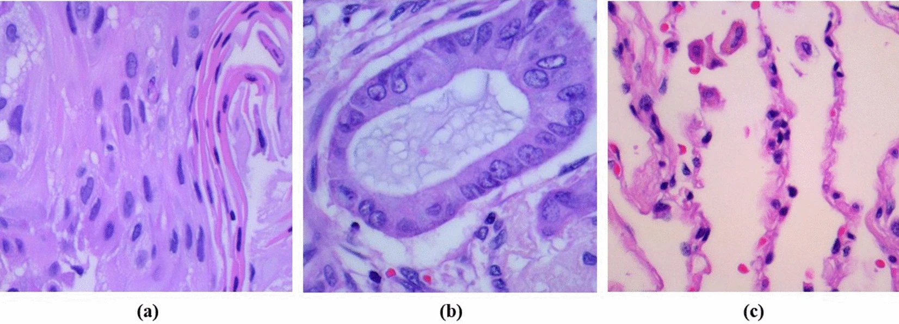
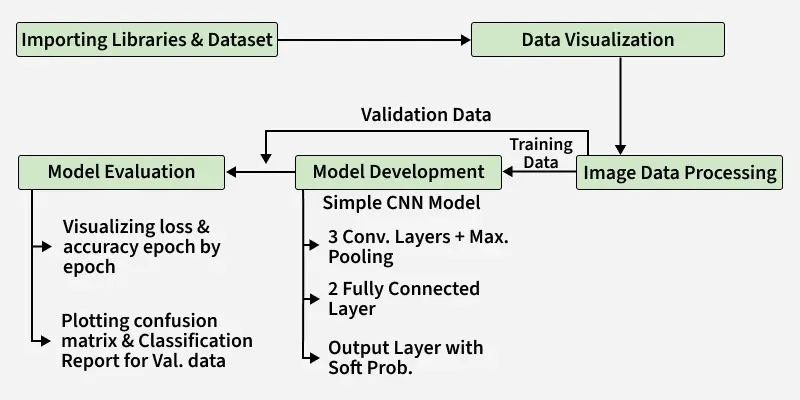
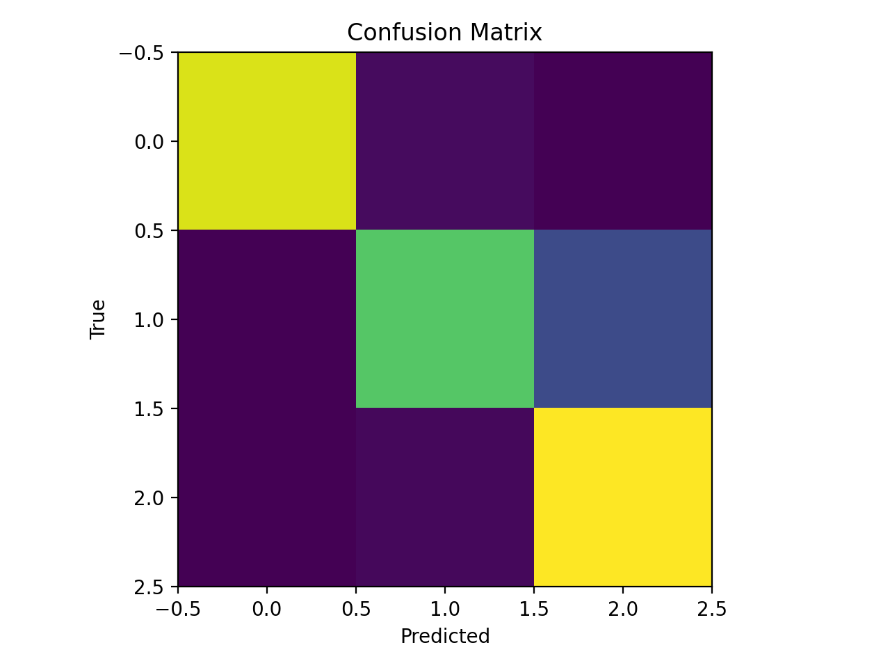

# Lung Cancer Detection (CNN) — End-to-End ML + Web Deployment

**Live site:** https://mdislammazharul.github.io/Lung_Cancer_Detection/

A complete, production-style **end-to-end** machine learning project that trains a **Convolutional Neural Network (CNN)** to classify lung histopathology images into three categories and ships it as a working web application:

- **Model training** (TensorFlow/Keras)
- **Reproducible artifacts** (versioned model + metadata)
- **Public inference backend** (Hugging Face Space)
- **Public frontend** (React + Vite on GitHub Pages)
- **CI/CD** (GitHub Actions for Pages deploy)
- **Large model handling** (>100MB) using Git LFS + Hugging Face Hub

---

## Table of Contents

- [Project Overview](#project-overview)
- [Dataset](#dataset)
- [Tech Stack](#tech-stack)
- [Model](#model)
- [Training Pipeline](#training-pipeline)
- [Model Evaluation](#model-evaluation)
- [Deployment Architecture](#deployment-architecture)
- [Repository Structure](#repository-structure)
- [How to Reproduce the Project (End-to-End)](#how-to-reproduce-the-project-end-to-end)
- [License (MIT)](#license-mit)

---

## Project Overview

This project builds a CNN classifier to detect lung cancer subtypes from histopathology images:

### Classes
- `lung_n` — normal lung tissue  
- `lung_aca` — lung adenocarcinoma  
- `lung_scc` — lung squamous cell carcinoma



The dataset examples are shown below: 
- **(a) representing lung adenocarcinoma**, 
- **(b) showing lung squamous cell carcinoma**, 
- **(c) depicting normal cells**.

This concept was explored in depth by Tian, L., Wu, J., Song, W. et al, *Precise and automated lung cancer cell classification using deep neural network with multiscale features and model distillation*, Sci Rep 14, 10471 (2024). [DOI/Link](https://doi.org/10.1038/s41598-024-61101-7)

The model is trained on a Kaggle histopathology dataset and deployed in a user-facing web app:

- User uploads an image
- The app calls a public inference API hosted on **Hugging Face Spaces**
- The app displays predicted class probabilities and final label

---

## Dataset

**Dataset used:** *Lung and Colon Cancer Histopathological Images* ([Kaggle](https://www.kaggle.com/datasets/andrewmvd/lung-and-colon-cancer-histopathological-images))

This dataset contains 25,000 histopathological images with 5 classes, including Lung and Colon Cancer images, but in this project we just took the Lung Cancer images. All images are 768 x 768 pixels in size and are in jpeg file format.
The images were generated from an original sample of HIPAA compliant and validated sources, consisting of 750 total images of lung tissue (250 benign lung tissue, 250 lung adenocarcinomas, and 250 lung squamous cell carcinomas) and augmented to 25,000 using the Augmentor package.

Structure (after extraction):
```

lung_colon_image_set/
lung_image_sets/
lung_n/
lung_aca/
lung_scc/
...
````
---

## Model

This process has been followed to build the classifier:


Ref: Lung Cancer Detection using Convolutional Neural Network (CNN) [Link](https://www.geeksforgeeks.org/deep-learning/lung-cancer-detection-using-convolutional-neural-network-cnn/)

### Architecture (Keras Sequential CNN)

- `Conv2D(32, 5x5) + MaxPool`
- `Conv2D(64, 3x3) + MaxPool`
- `Conv2D(128, 3x3) + MaxPool`
- Flatten
- Dense(256) + BatchNorm
- Dense(128) + Dropout + BatchNorm
- Dense(3, softmax)

### Training configuration

- Image size: **256 × 256**
- Split: **80% train / 20% validation**
- Batch size: **64**
- Epochs: **10**
- Optimizer: **Adam**
- Loss: **Categorical Cross-Entropy**
- Callbacks:
  - EarlyStopping (monitor val_accuracy)
  - ReduceLROnPlateau (monitor val_loss)
  - Custom callback to stop if val_accuracy exceeds threshold

---

## Training Pipeline

### 1) Create dataset arrays

- Load `.jpeg` files from each class directory
- Read with OpenCV
- Resize to (256,256)
- Store:
  - `X` as `np.ndarray` of shape `(N, 256, 256, 3)`
  - `Y` as one-hot labels

### 2) Train/Val split

```python
X_train, X_val, Y_train, Y_val = train_test_split(
    X, one_hot_encoded_Y, test_size=0.2, random_state=2022
)
````

### 3) Train

```python
history = model.fit(
    X_train, Y_train,
    validation_data=(X_val, Y_val),
    batch_size=64,
    epochs=10,
    callbacks=[es, lr, myCallback()]
)
```

---

## Tech Stack

### Machine Learning
- Python 3.11
- TensorFlow / Keras
- NumPy
- OpenCV (headless)
- scikit-learn (evaluation + report)

### Backend (Inference API)
- FastAPI
- Uvicorn
- Pydantic

### Frontend
- React
- Vite
- JavaScript (Fetch API)

### Deployment / MLOps
- Docker (containerized backend)
- GitHub Pages (frontend hosting)
- GitHub Actions (CI/CD for pages)
- Hugging Face Spaces

---

## Model Evaluation

<div style="display: flex; justify-content: space-between;">
    
    
</div>

The trained CNN was evaluated on a held-out test set of 3,000 histopathological lung images across three classes: normal lung tissue (lung_n), lung adenocarcinoma (lung_aca), and lung squamous cell carcinoma (lung_scc).

### Classification Report

| Class     | Precision | Recall | F1-score | Support |
|-----------|-----------|--------|----------|---------|
| lung_n    | 1.00      | 0.97   | 0.98     | 987     |
| lung_aca  | 0.93      | 0.76   | 0.84     | 977     |
| lung_scc  | 0.81      | 0.98   | 0.89     | 1036    |
| **Accuracy** |           |        | **0.90** | **3000** |
| **Macro Avg** | **0.92** | **0.90** | **0.90** | **3000** |
| **Weighted Avg** | **0.91** | **0.90** | **0.90** | **3000** |

- **Normal lung tissue (lung_n)** shows near-perfect performance, indicating the model reliably distinguishes healthy tissue from cancerous samples.
- **Lung adenocarcinoma (lung_aca)** has high precision but lower recall, meaning some adenocarcinoma cases are missed, though predictions are usually correct when made.
- **Lung squamous cell carcinoma (lung_scc)** achieves very high recall, successfully detecting most positive cases, with a trade-off in precision due to a higher false-positive rate.
- The strong macro and weighted averages indicate balanced performance across classes and robustness to class distribution differences.

The model achieves high training accuracy (~0.98) but struggles with generalization, as reflected by a lower and fluctuating validation accuracy (~0.6). The confusion matrix suggests that the model performs well on **normal lung tissue (lung_n)** and **lung squamous cell carcinoma (lung_scc)**, but has difficulty distinguishing **lung adenocarcinoma (lung_aca)** from the other classes.

Typical findings in this problem type:

* High training accuracy can occur quickly
* Validation can fluctuate (overfitting risk)
* Improvements typically come from:

  * stronger regularization / augmentation
  * transfer learning backbone (EfficientNet/MobileNet)
  * class balancing and better sampling
  * careful learning rate schedules

---

## Deployment Architecture

This project uses a **free** production-like architecture:

### Backend (Inference)

* Hosted on **Hugging Face Spaces** using **Gradio**
* Loads model artifacts from **Hugging Face Hub**
* Exposes a queued Gradio endpoint (`/gradio_api/...`)

### Frontend

* Hosted on **GitHub Pages** (static)
* Built with **React + Vite**
* Calls the Hugging Face Space API:

  1. upload image
  2. start predict (receives `event_id`)
  3. stream result via SSE until complete
---

## Repository Structure

```text
.
├── .github/
│   └── workflows/
│       ├── pages.yml                     # GitHub Pages CI/CD for frontend
│       └── ci.yml                        # checks / lint / tests
│
├── artifacts/
│   ├── models/
│   │   └── v1/
│   │       ├── lung_cnn.keras            # trained CNN model (used by backend)
│   │       ├── classes.json              # class index → label mapping
│   │       └── metadata.json             # training + preprocessing metadata
│   └── reports/
│       └── classification_report.txt     # evaluation metrics (precision/recall/F1)
│
├── backend/                              # FastAPI inference service
│   ├── requirements-backend.txt          # minimal deps for inference only
│   ├── main.py                           # FastAPI app entry point
│   ├── inference.py                      # prediction logic
│   └── model_loader.py                   # lazy / cached model loading
│
├── data/
│   ├── raw/
│   │   └── lung_colon_image_set/          # Kaggle dataset (not versioned)
│   │       ├── colon_image_sets/
│   │       └── lung_image_sets/
│   │           ├── lung_aca/
│   │           ├── lung_n/
│   │           └── lung_scc/
│   ├── processed/                        # cleaned / resized images (if generated)
│   └── sample_requests/                  # example inputs for API testing
│
├── frontend/                             # React + Vite frontend
│   ├── src/
│   │   ├── App.jsx
│   │   ├── main.jsx
│   │   └── lungSpaceApi.js               # API client (local FastAPI or HF Space)
│   ├── vite.config.js                    # base path config for GitHub Pages
│   ├── package.json
│   └── package-lock.json
│
├── Lung_Cancer_Detection/                # exported / legacy local artifacts
│   ├── lung_cnn.h5
│   ├── lung_cnn.keras
│   ├── classes.json
│   └── metadata.json
│
├── Lung_Cancer_Detection_HF_Space/        # Hugging Face Space deployment
│   ├── app.py                            # HF Space entry point
│   └── requirements.txt
│
├── notebooks/                            # EDA, debugging, experiments
│
├── src/
│   └── lung_cancer/                      # training & evaluation pipeline
│       ├── dataset.py                    # dataset loading & preprocessing
│       ├── model.py                      # CNN architecture
│       ├── train.py                      # training loop
│       ├── evaluate.py                   # evaluation + metrics
│       ├── predict.py                    # offline prediction utilities
│       ├── utils.py                      # shared helpers
│       └── config.py                     # constants / paths / hyperparameters
│
├── figures/                              # plots, diagrams, screenshots
│
├── Dockerfile                            # containerized FastAPI backend
├── .dockerignore
├── .env                                 # local environment variables (not committed)
├── .gitattributes                       # Git LFS / text settings
├── .gitignore
├── requirements.txt                     # full training environment deps
└── README.md
```

---

## How to Reproduce the Project (End-to-End)

This section explains how to reproduce the project from scratch, including model training, backend inference, and the frontend web application. You can either retrain the model or directly run inference using the provided artifacts.

---

### Step 1: Clone the Repository

```bash
git clone https://github.com/mdislammazharul/Lung_Cancer_Detection.git
cd Lung_Cancer_Detection
````

---

### Step 2: (Optional) Reproduce Model Training

This step is only required if you want to retrain the CNN.
If you only want to run inference, skip to Step 3.

#### 2.1 Create a Training Environment

```bash
python -m venv .venv
# Windows
.venv\Scripts\activate
# macOS / Linux
source .venv/bin/activate
```

#### 2.2 Install Training Dependencies

```bash
pip install -r requirements.txt
```

#### 2.3 Dataset Setup

Download the Kaggle dataset:
**Lung and Colon Cancer Histopathological Images**

Place the dataset under:

```text
data/raw/lung_colon_image_set/
```

Expected structure:

```text
data/raw/lung_colon_image_set/lung_image_sets/
├── lung_aca/
├── lung_n/
└── lung_scc/
```

#### 2.4 Train the CNN Model

```bash
python -m src.lung_cancer.train
```

#### 2.5 Training Outputs

The training pipeline generates production-ready artifacts in:

```text
artifacts/models/v1/
├── lung_cnn.keras
├── classes.json
└── metadata.json
```

These artifacts are consumed directly by the backend inference service.

---

### Step 3: Run the Backend Inference API

You can run the backend either locally or using Docker.

---

#### Option A: Run Backend Locally (Without Docker)

1. Create and activate a virtual environment (if not already active)

```bash
python -m venv .venv
# Windows
.venv\Scripts\activate
# macOS / Linux
source .venv/bin/activate
```

2. Install backend dependencies

```bash
pip install -r backend/requirements-backend.txt
```

3. Verify model artifacts exist

```text
artifacts/models/v1/
├── lung_cnn.keras
├── classes.json
└── metadata.json
```

4. Start the FastAPI server

```bash
uvicorn backend.main:app --host 0.0.0.0 --port 8000
```

Backend will be available at:

* [http://localhost:8000](http://localhost:8000)
* Interactive docs: [http://localhost:8000/docs](http://localhost:8000/docs)

---

#### Option B: Run Backend with Docker (Recommended)

This method exactly matches the production inference setup.

1. Build the Docker image

```bash
docker build -t lung-backend .
```

2. Run the container

```bash
docker run --rm -p 8000:8000 lung-backend
```

Notes:

* Base image: python:3.11-slim
* GPU disabled via `CUDA_VISIBLE_DEVICES=-1`
* OpenCV system dependencies are installed inside the container

---

#### Option C: Run Backend Directly from Docker Hub (No Build Required)

The backend inference service is published on Docker Hub and can be pulled and run directly without building the image locally.

Docker Hub repository:
https://hub.docker.com/r/mdislammazharul/lung-cancer-api

```bash
docker pull mdislammazharul/lung-cancer-api:latest
```
---

### Step 4: Run the Frontend Locally

1. Navigate to the frontend directory

```bash
cd frontend
```

2. Install dependencies

```bash
npm install
```

3. Start the development server

```bash
npm run dev
```

The frontend will be available at the local Vite URL (usually [http://localhost:5173](http://localhost:5173)).

---

### Step 5: Configure Frontend API Endpoint

The frontend communicates with the inference backend via `lungSpaceApi.js`.

Set the API base URL to one of the following:

* Local backend: `http://localhost:8000`
* Hosted backend: Hugging Face Space URL (if used)
---

## License (MIT)

MIT License

Copyright (c) 2025 Md Mazharul Islam